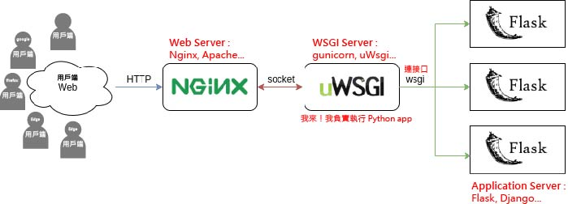

開始前我們先看看圖，會更好理解


### 為什麼我們需要 WSGI？

WSGI(全名 Python Web Server Gateway Interface) 是一個定義了 Python app 和 Web server 或稱 WSGI server 之間溝通的規範，作為通用接口。
以 WSGI 規範為基礎開發的 python app，使我們可以在不更動應用程式的情況下，在各系統如 linux、windows 上，連接或切換不同的 Web server，例如:gunicorn；這大大提高了應用程式的靈活性、可移植性，我們只需要選擇符合 WSGI 規範的 Web server 做使用，就可以無痛切換使用各種 Web server。

- **NGINX 與 gunicorn 都可以稱為 Web server，那為什麼要一起使用呢？有甚麼差？**
  NGINX 通常被作為前端服務器，負責接收使用者請求並進行負載均衡、反向代理等。Gunicorn 則是符合 WSGI 規範的後端服務器，負責執行 python app。
  傳統 web server，這裡以 NGINX 為例；NGINX 負責接收使用者請求，但 NGINX 無法執行 python app，因此還需要一個可以執行 python app 的 web server 或稱 WSGI server，例如 Gunicorn 來執行我們的 python app。
  [Nginx 是什麼？有哪些用途？](https://www.explainthis.io/zh-hant/swe/why-nginx)

### WSGI 跟 WSGI Server 有什麼不一樣？

WSGI 是規範，WSGI server 指的是符合 WSGI 規範的 web server，例如：gunicorn、uwsgi 等…

### ASGI 又是什麼？

ASGI (Asynchronous Server Gateway Interface)，是以 WSGI 為基礎發展而來，用于支援非同步 Python app 的規範；顧名思義，與 WSGI 不同的是， ASGI 允許我們能夠在 python app 中執行非同步程式碼，能夠同時處理多個請求，而不是等待一個請求處理完畢才能處理下一個請求。

與 WSGI 類似，ASGI 規範作為通用接口，我們可以**連接或切換各種符合 ASGI 規範的 Web server**，例如：Daphne、uvicorn。

[什麼是 WSGI & ASGI ? (Python 面試題)](https://medium.com/@eric248655665/什麼是-wsgi-為什麼要用-wsgi-f0d5f3001652)

[asgiref/docs](https://github.com/django/asgiref/blob/main/docs/introduction.rst)

[Flask 想上線? 你還需要一些酷東西](https://minglunwu.com/notes/2021/flask_plus_wsgi.html/)

### Gunicorn 是什麼？該如何使用它？

Gunicorn 是一個開源的 Python WSGI HTTP server，用於執行 Python app。廣泛用於部署 Python Web app，例如 Django、Flask 等。

Gunicorn 的主要功能是接收來自客戶端的 HTTP 請求，並傳遞給相應的 Python app 進行處理，然後再將應用程序的回應傳遞回客戶端。

- **安裝 Gunicorn** - `pip install gunicorn`
- 建立 WSGI 入口點
  建立一個 wsgi.py 並做以下配置。
  ```python
  from myproject import app
  if __name__ == "__**main__**":
  app.run()
  ```
- 設置 **Gunicorn**
  wsgi - 指的是入口點腳本，也就是 wsgi.py。
  app - 指的是你的應用程式可呼叫的名稱，這裡是 app。
  --bind - 用於綁定 Gunicorn 伺服器可造訪的 ip 地址和 port。
  0.0.0.0 - Gunicorn 伺服器可造訪的 ip 地址，0.0.0.0 表示任何可用的網路介面地址。
  :5000 - 指定端口號，指定 Gunicorn 伺服器能在本機的 5000 端口上接收請求。
  ```bash
  (your project .env) $ gunicorn --bind 0.0.0.0:5000 wsgi:app
  ```
- 建立並設定 systemd 服務單元檔案，使 Ubuntu 開機時，Gunicorn 伺服器會自動啟用。

  ```bash
  (your project .env) $ sudo nano /etc/systemd/system/*your project name*.service
  ```

  _your project_.service

  ```
  [Unit]
  Description=Gunicorn instance to servemyproject
  After=network.target

  [Service]
  User=*Ubuntu*
  Group=www-data
  WorkingDirectory=/home/Ubuntu/*your project*
  Environment="PATH=/home/Ubuntu/*your project*/*your project .env*/bin"
  ExecStart=/home/Ubuntu/*your project*/*your project .env*/bin/gunicorn --workers 3 --bind unix:*your project*.sock -m 007wsgi:app

  [Install]
  WantedBy=multi-user.target
  ```

  啟動 _your project_.service 檔案- `sudo systemctl start *your project*`。
  啟用 _your project_.service 檔案- `sudo systemctl enable *your project*`。
  檢查狀態- `sudo systemctl status *your project*`。

  ```bash
  (your project .env) $ sudo systemctl start myproject
  (your project .env) $ sudo systemctl enable myproject
  (your project .env) $ sudo systemctl status myproject
  ```

  應該看到如下輸出：

  ```
  Output
  ● myproject.service - Gunicorn instance to serve *your project*
       Loaded: loaded (/etc/systemd/system/*your project*.service; enabled; vendor preset: enabled)
       Active: active (running) since Tue 2022-05-10 19:40:41 UTC; 9s ago
     Main PID: 17300 (gunicorn)
        Tasks: 4 (limit: 2327)
       Memory: 56.0M
          CPU: 514ms
       CGroup: /system.slice/*your project*.service
  . . .
  ```

### 如何使用 HTTPS？**http 與 https 的差異**？

**HTTP -** 默認使用端口 80，通信數據是明文傳輸，並且沒有加密措施，因此容易受到窺探和中間人攻擊的威脅和竄改。

**HTTPS -** 默認使用端口 443，通信數據是通過 SSL/TLS 協議進行加密的，因此可以保護數據在傳輸過程中的安全性，防止被竊取和竄改。

要使用 HTTPS，需要在 Web server 上安裝 SSL/TLS 憑證，這個憑證用於加密和驗證網站的身份；通常會從可信任的證書授權機構（CA）購買這樣的憑證，或是自行創建(自簽證)；憑證安裝完成後，我們就可以透過對 Web server（如 Apache、Nginx 等） 的設定，使其可以接受和處理加密的 HTTPS 安全連接 。
