# 撰寫各頁面的 User Story

1 登入
2 註冊
3 個人資料
4 訂單頁
5 我的最愛
6 首頁
7 汽車列表頁\*2 單一汽車頁(資訊)
8 租車頁

### 訪客

我可以 在**首頁** 透過連結導航到汽車列表，查看可承租車輛、取得租車 app、登入頁面、註冊頁面。

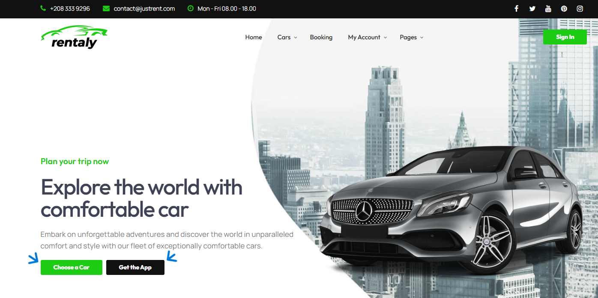

我可以 在**首頁** 查看可承租的車輛。

我可以 在**首頁** 利用分頁功能查看有提供的車型。

我可以 在**首頁** 查看有提供的服務、客戶評價、相關文章。

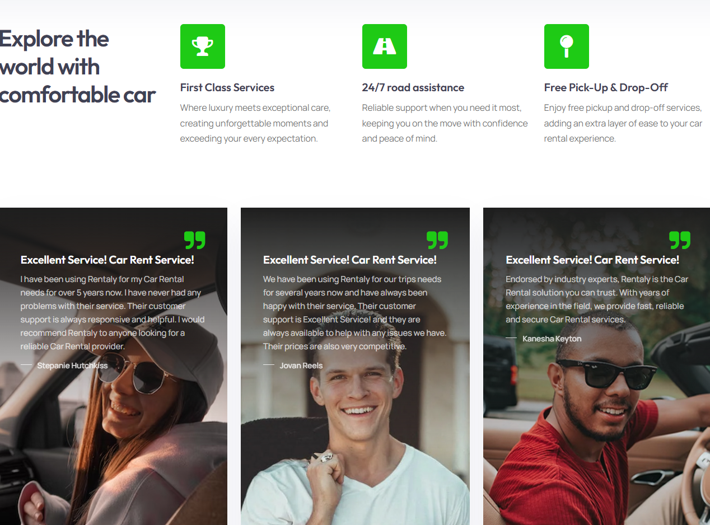

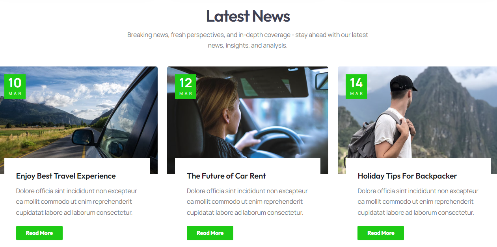

我可以 在**註冊頁面**，註冊為會員。

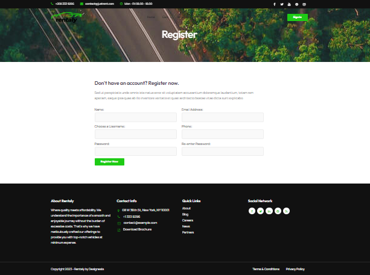

我可以 在**登入頁面**，登入會員，才可以進行租車、個人資料等會員權限的操作。

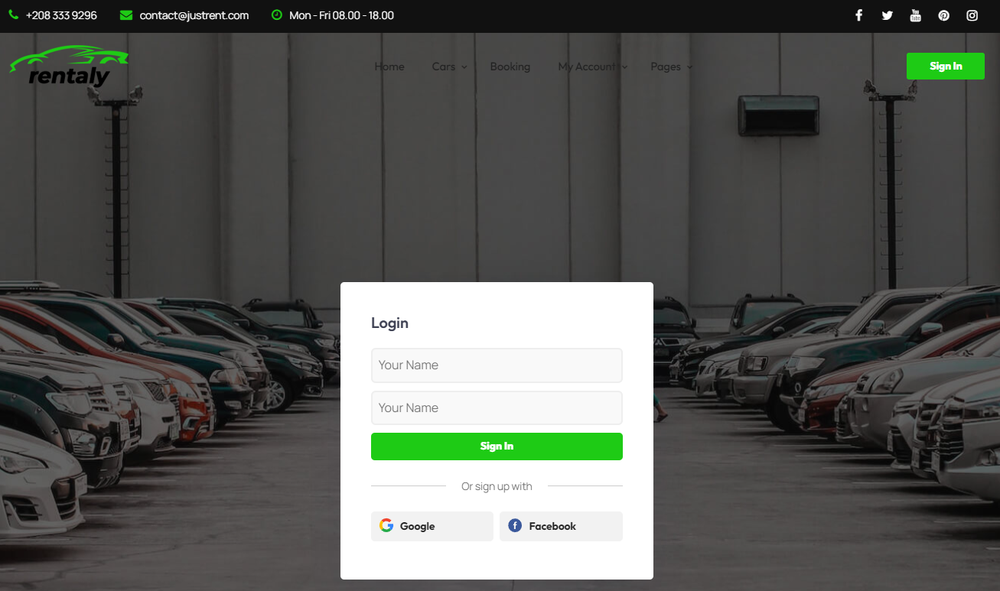

我可以 在**汽車列表頁面**，查看所有可承租車輛，並且可以利用條件篩選更快的找到我想要的車。

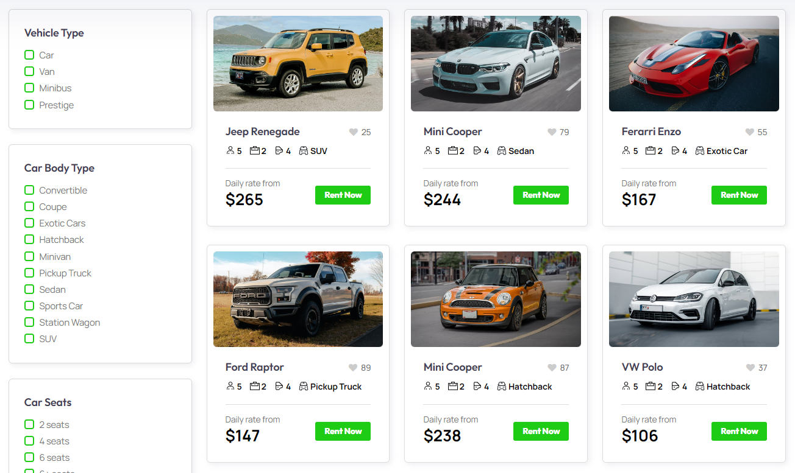

我可以 在**單一汽車頁面**，查看該車輛的詳細資訊，並輸入租車的時間地點等資訊開始租車。

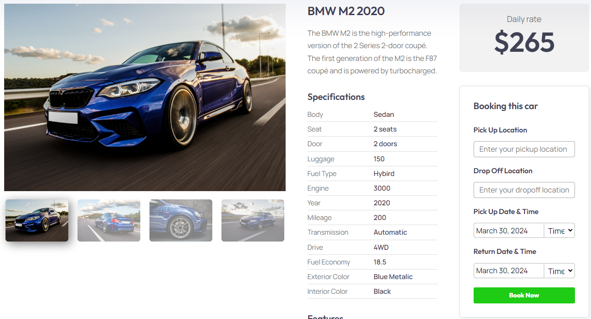

我可以 在**租車頁面**，輸入租車的時間地點等資訊，以便篩選找到符合我的條件的所有車輛。

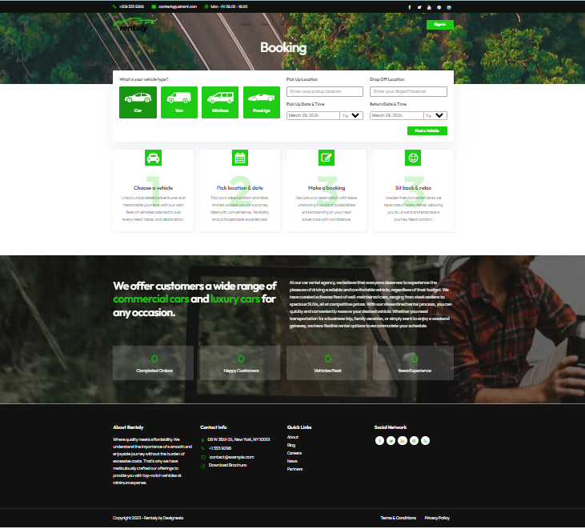

### 會員

我可以 在**個人資料頁面** 編輯我的個人資訊及偏好設定、通知設定，並且可以選擇登出。

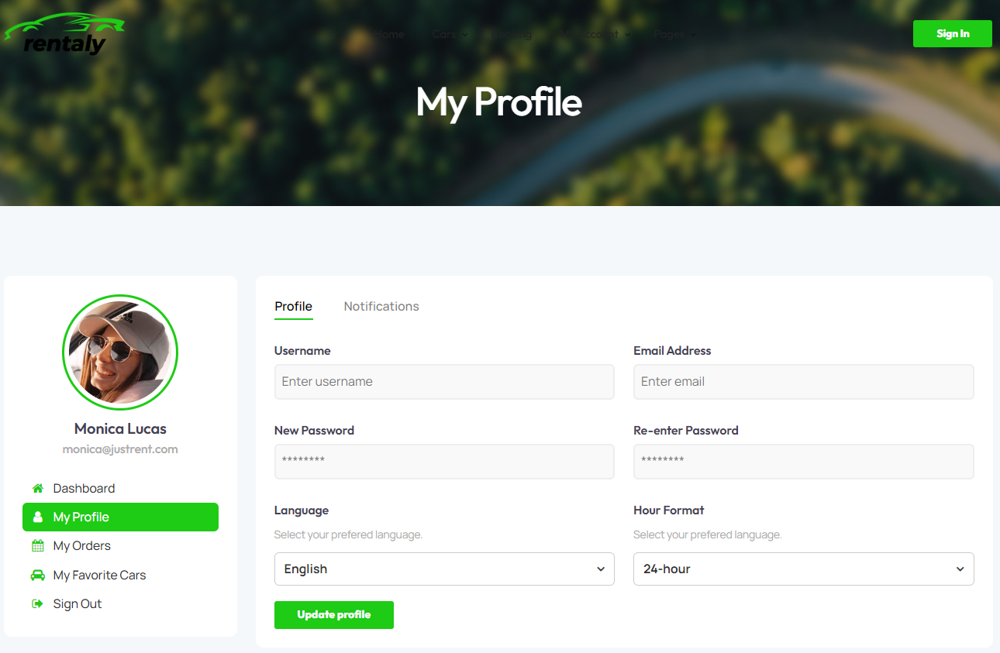

我可以 在**個人訂單頁面** 查看我的訂單資訊及狀態，並且可以選擇登出。

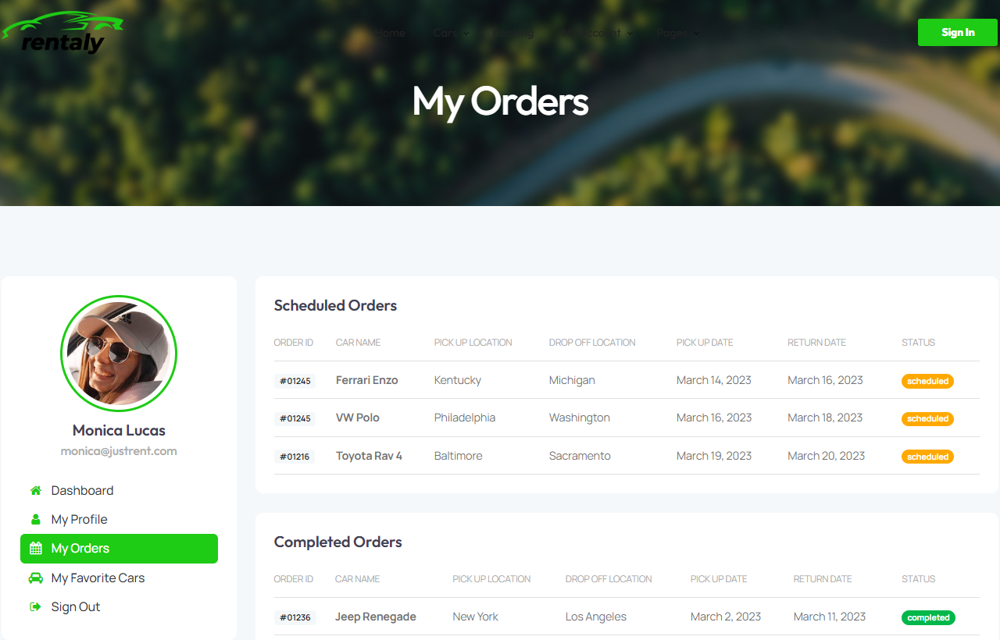

我可以 在**我的最愛頁面** 查看我已收藏的喜好車款，以便下次可以更快速、方便的找到喜歡的車款，並且可以選擇登出。

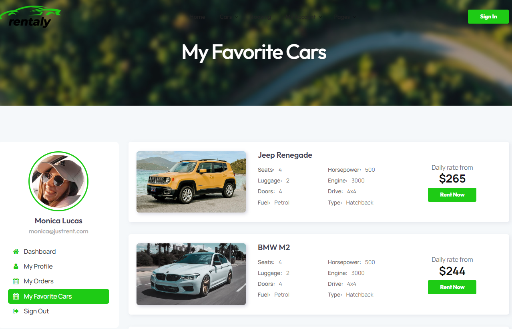
